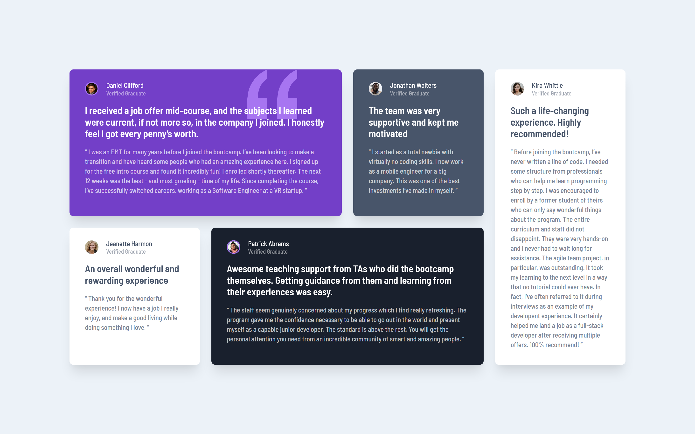

# Frontend Mentor - Testimonials grid section solution

This is a solution to the [Testimonials grid section challenge on Frontend Mentor](https://www.frontendmentor.io/challenges/testimonials-grid-section-Nnw6J7Un7). Frontend Mentor challenges help you improve your coding skills by building realistic projects. 

## Table of contents

- [Overview](#overview)
  - [The challenge](#the-challenge)
  - [Screenshot](#screenshot)
  - [Links](#links)
- [My process](#my-process)
  - [Built with](#built-with)
  - [What I learned](#what-i-learned)
  - [Continued development](#continued-development)
  - [Useful resources](#useful-resources)
- [Author](#author)

## Overview

### The challenge

Users should be able to:

- View the optimal layout for the site depending on their device's screen size

### Screenshot



### Links

- [See the solution on Frontend Mentor](https://www.frontendmentor.io/solutions/mobile-first-using-tailwind-css-MNN9-rxaH)
- [See live demo](https://testimonials-grid-tailwindcss.vercel.app/)

## My process

### Built with

- Semantic HTML5 markup
- CSS Grid
- [Tailwind CSS](https://tailwindcss.com/) - CSS framework
- Mobile-first workflow

### What I learned

This was my first time using Tailwind CSS and I really enjoyed it. The only other framework I have experience with so far is Bootstrap, and I found Tailwind CSS a lot easier to use and customise.

I added custom colors as they are in the design, custom font and background image.

```js
theme: {
    extend: {
      colors: {
        violet: {
          DEFAULT: '#733FC8',
          light: '#A775F1'
        },
        grey: {
          dark: '#19202D',
          medium: '#48556A',
          light: '#ECF2F8'
        }
      },
      fontFamily: {
        'barlow': '"Barlow Semi Condensed", sans-serif',
      },
      backgroundImage: theme => ({
        'background-quote': "url('/images/bg-pattern-quotation.svg')",
      }),
      backgroundPosition: {
        'background-quote': 'top 0% left 80%',
      }
    },
  },
```


### Continued development

I definitely want to use Tailwind CSS with a more complex design to learn more about it.

### Useful resources

I found Tailwind CSS documentation very helpful, especially when it came to customisation. If you're struggling with setup of configuration, I also watched parts of a tutorial by The Net Ninja on youtube and found it very helpful.

## Author

- Frontend Mentor - [@AgataLiberska](https://www.frontendmentor.io/profile/AgataLiberska)
- Twitter - [@AgataLiberska](https://www.twitter.com/agataliberska)
- Instagram - [@naturalniepoangielsku](https://www.instagram.com/naturalnie_po_angielsku)
